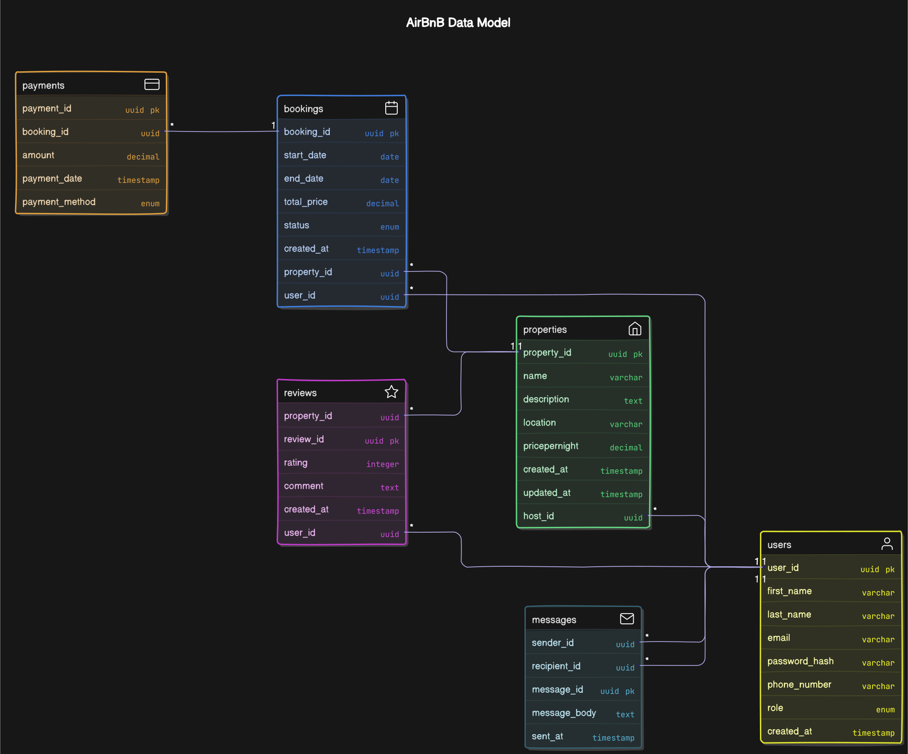

# ERD Documentation

## Database Schema Visualization

## 📋 Entities and Attributes

---

### 👤 User

- `user_id`: **UUID**, Primary Key, Indexed
- `first_name`: VARCHAR, **NOT NULL**
- `last_name`: VARCHAR, **NOT NULL**
- `email`: VARCHAR, **UNIQUE, NOT NULL**
- `password_hash`: VARCHAR, **NOT NULL**
- `phone_number`: VARCHAR, NULL
- `role`: ENUM (`guest`, `host`, `admin`), **NOT NULL**
- `created_at`: TIMESTAMP, **DEFAULT CURRENT_TIMESTAMP**

**Indexes & Constraints**
- `email`: UNIQUE
- Required: `first_name`, `last_name`, `email`, `password_hash`, `role`

---

### 🏠 Property

- `property_id`: **UUID**, Primary Key, Indexed
- `host_id`: UUID, Foreign Key → `User(user_id)`
- `name`: VARCHAR, **NOT NULL**
- `description`: TEXT, **NOT NULL**
- `location`: VARCHAR, **NOT NULL**
- `pricepernight`: DECIMAL, **NOT NULL**
- `created_at`: TIMESTAMP, **DEFAULT CURRENT_TIMESTAMP**
- `updated_at`: TIMESTAMP, **ON UPDATE CURRENT_TIMESTAMP**

**Constraints**
- Foreign Key: `host_id → User(user_id)`
- Required: `name`, `description`, `location`, `pricepernight`

---

### 📅 Booking

- `booking_id`: **UUID**, Primary Key, Indexed
- `property_id`: UUID, Foreign Key → `Property(property_id)`
- `user_id`: UUID, Foreign Key → `User(user_id)`
- `start_date`: DATE, **NOT NULL**
- `end_date`: DATE, **NOT NULL**
- `total_price`: DECIMAL, **NOT NULL**
- `status`: ENUM (`pending`, `confirmed`, `canceled`), **NOT NULL**
- `created_at`: TIMESTAMP, **DEFAULT CURRENT_TIMESTAMP**

**Constraints**
- Foreign Keys: `property_id → Property(property_id)`, `user_id → User(user_id)`
- Valid status values: `pending`, `confirmed`, `canceled`

---

### 💳 Payment

- `payment_id`: **UUID**, Primary Key, Indexed
- `booking_id`: UUID, Foreign Key → `Booking(booking_id)`
- `amount`: DECIMAL, **NOT NULL**
- `payment_date`: TIMESTAMP, **DEFAULT CURRENT_TIMESTAMP**
- `payment_method`: ENUM (`credit_card`, `paypal`, `stripe`), **NOT NULL**

**Constraints**
- Foreign Key: `booking_id → Booking(booking_id)`

---

### 🌟 Review

- `review_id`: **UUID**, Primary Key, Indexed
- `property_id`: UUID, Foreign Key → `Property(property_id)`
- `user_id`: UUID, Foreign Key → `User(user_id)`
- `rating`: INTEGER, **CHECK (1 ≤ rating ≤ 5), NOT NULL**
- `comment`: TEXT, **NOT NULL**
- `created_at`: TIMESTAMP, **DEFAULT CURRENT_TIMESTAMP**

**Constraints**
- Foreign Keys: `property_id → Property(property_id)`, `user_id → User(user_id)`
- Rating must be between 1 and 5

---

### 💬 Message

- `message_id`: **UUID**, Primary Key, Indexed
- `sender_id`: UUID, Foreign Key → `User(user_id)`
- `recipient_id`: UUID, Foreign Key → `User(user_id)`
- `message_body`: TEXT, **NOT NULL**
- `sent_at`: TIMESTAMP, **DEFAULT CURRENT_TIMESTAMP**

**Constraints**
- Foreign Keys: `sender_id → User(user_id)`, `recipient_id → User(user_id)`

---

## 🔗 Relationships

- **User ↔ Property**: One-to-Many (`User.user_id` → `Property.host_id`)
- **User ↔ Booking**: One-to-Many (`User.user_id` → `Booking.user_id`)
- **Property ↔ Booking**: One-to-Many (`Property.property_id` → `Booking.property_id`)
- **Booking ↔ Payment**: One-to-One (`Booking.booking_id` → `Payment.booking_id`)
- **User ↔ Review ↔ Property**: Many-to-Many with attributes (`Review`)
- **User ↔ Message**: Self-referencing One-to-Many (sender and recipient)

---

## 📈 Indexing Summary

- **Primary Keys**: Auto-indexed
- **Additional Indexes**:
  - `User.email`
  - `Property.property_id`
  - `Booking.property_id`, `Booking.booking_id`
  - `Payment.booking_id`

---

## 📌 Notes

- All UUIDs are assumed to be auto-generated and indexed.
- Timestamps use default current values.
- ENUMs restrict values for better integrity and validation.